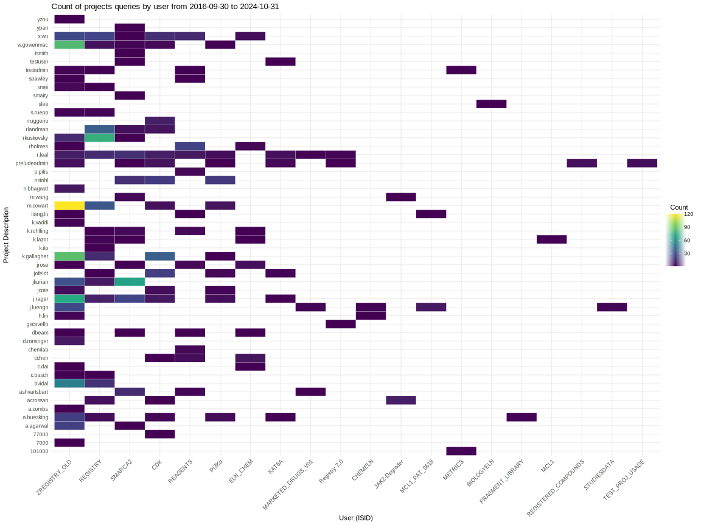
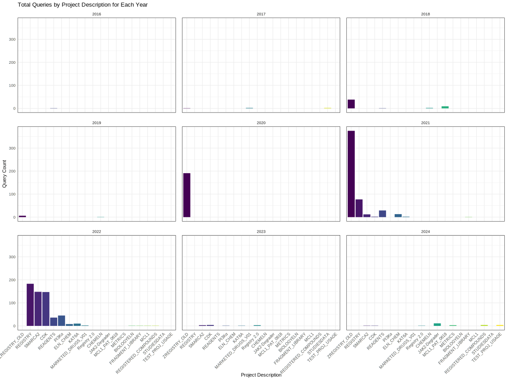

[Home](../../main.md) | [Prev: Day 19](../10/notes_2024-10-31.md) | [Next: Day 21](./notes_2024-11-04.md)

## 📝 Day 20, Friday - `notes_2024-11-01.md`

#### User story 152
- Investigate number displaying issue
- `PRT1003404-007` : 0.0001
- `PRT1011907-001` : 00
- `PRT1011945-001` : 00
- `PRT5000260-002` : 43.335
- changed case statement in `IC50_NEW_RESULTS_SUMMARY` view on DEV:

```sql
CASE
    WHEN substr(t1.reported_result, 1, 1) IN ('>', '<') THEN 
      to_char(substr( t1.reported_result, 2, 10), 'FM999999999990.9999EEEE')
    ELSE to_char(t1.reported_result, 'FM999999999990.9999EEEE')
END AS ic50_rr,
CASE
    WHEN substr(t1.reported_result, 1, 1) IN ('>', '<') THEN
      to_char(to_number(substr(t1.reported_result, 2, 10)) * 1000, 'FM999999999990.9999EEEE')
    ELSE to_char(to_number(t1.reported_result) * 1000, 'FM999999999990.9999EEEE')
END AS ic50_rr_nm
```
- The format `FM999999999990.9999EEEE` removes padding, allows for 12 significant digits in the whole number part, displays up to 4 decimal places, and formats the output in scientific notation when necessary, with a total of 16 significant figures possible when considering both parts

#### IC50_NEW_RESULTS_SUMMARY view
```sql
-- This was a SQL snippet to view the experiment_id data simply and quickly
SELECT 
    t3.display_name,
    t1.result_numeric,
    t1.param4,
    t1.modified_date,
    t1.status,
    t1.param1,
    t1.param2,
    t1.param3,
    t1.err,
    t1.r2,
    t1.x_min,
    t1.x_max,
    t1.y_min_obs,
    t1.y_max_obs,
    t1.y_max_minus_y_min,
    t1.y_min_obs_minus_y_min,
    t1.y_max_obs_minus_y_max,
    t1.reported_result,
    t1.x_at_y50,
    t1.y_at_min_x, 
    t1.y_at_max_x,
    t1.created_date,
    t1.x_unit,
    t1.x_at_min_y,
    t1.x_at_max_y,
    t1.group_id,
    t1.auc,
    t1.gr_aoc,
    t1.logx_auc
  FROM ds3_userdata.su_analysis_results t1
  INNER JOIN ds3_userdata.su_groupings t2 ON t1.group_id = t2.id
  INNER JOIN ds3_userdata.su_samples t3 ON t2.sample_id = t3.id
  WHERE t2.experiment_id = 260857
    AND t3.display_name IN ('PRT1003404-007', 'PRT1011907-001', 'PRT1011945-001 '
                            ,  'PRT5000260-002');

-- DDL from DM for view
CREATE OR REPLACE FORCE EDITIONABLE 
VIEW ds3_userdata.ic50_new_results_summary (
experiment_id,
id,
plate_number,
analysis_name,
modified_date,
x_max,
x_min,
reported_result,
status,
min,
max,
slope,
ic50,
analysis_results_id,
compound_status,
ic50_rr,
ic50_rr_nm,
ic50_org,
err,
r2,
sam_id,
protocol_id,
classification,
max_response,
absolute_ic50,
highest_concentration,
response_at_hc,
z_prime,
low_avg,
high_avg,
well_analysis_id ) AS
    WITH t AS (
        SELECT
            t4.experiment_id AS experiment_id,
            t3.display_name  AS id,
            t6.name          AS analysis_name,
            TO_DATE(substr(
                t1.modified_date, 1, 10
            ))               AS modified_date,
            t10.plate_number,
            t1.id            AS analysis_results_id,
            t1.x_max,
            t1.x_min,
            t1.reported_result,
            t1.status,
            t1.param1        AS min,
            t1.param2        AS max,
            t1.param3        AS slope,
            CASE
            WHEN t5.label = 'Inactive'    THEN
            t1.x_max
            WHEN t5.label = 'Very Potent' THEN
            t1.x_min
            ELSE
            t1.param4
            END              AS ic50,
            CASE
            WHEN t5.label = 'Inactive'    THEN
            '>'
            WHEN t5.label = 'Very Potent' THEN
            '<'
            END              AS compound_status,
            CASE
            WHEN substr(
                t1.reported_result, 1, 1
            ) IN ( '>', '<' ) THEN
            round(
                substr(
                    t1.reported_result, 2, 10
                ), 4
            )
            ELSE
            round(
                t1.reported_result, 4
            )
            END              AS ic50_rr,
            CASE
            WHEN substr(
                t1.reported_result, 1, 1
            ) IN ( '>', '<' ) THEN
            round(
                TO_NUMBER(substr(
                    t1.reported_result, 2, 10
                )) * 1000, 4
            )
            ELSE
            round(
                TO_NUMBER(t1.reported_result) * 1000, 4
            )
            END              AS ic50_rr_nm,
            t1.param4        AS ic50_org,
            t1.err           AS err,
            t1.r2            AS r2,
            t3.id            AS sam_id,
            t4.protocol_id,
            t5.label         AS classification,
            t8.result        AS ic90,
            t11.z_prime      AS z_prime,
            t11.low_avg,
            t11.high_avg,
            t11.well_analysis_id,
            t9.name          AS name
        FROM
            ds3_userdata.su_analysis_results     t1
            LEFT JOIN ds3_userdata.su_groupings            t2 ON t1.group_id = t2.id
            LEFT JOIN ds3_userdata.su_samples              t3 ON t2.sample_id = t3.id
            LEFT JOIN ds3_userdata.tm_experiments          t4 ON t2.experiment_id = t4.experiment_id
            LEFT JOIN ds3_userdata.su_plates               t10 ON t10.experiment_id = t2.experiment_id
                                                    AND t2.plate_set = t10.plate_set
            LEFT JOIN (
                SELECT
                    b.experiment_id,
                    b.plate_number,
                    a.plate_id,
                    c.well_analysis_id,
                    round(
                        z_prime, 4
                    ) AS z_prime,
                    low_avg,
                    high_avg
                FROM
                    ds3_userdata.su_plate_results a
                    LEFT JOIN ds3_userdata.su_plates        b ON a.plate_id = b.id
                    LEFT JOIN ds3_userdata.su_well_layers   c ON b.experiment_id = c.experiment_id
                                                               AND a.layer_id = c.id
                WHERE
                    c.well_analysis_id = 1
                ORDER BY
                    b.experiment_id,
                    b.plate_number
            )                                    t11 ON t10.id = t11.plate_id
            LEFT JOIN ds3_userdata.su_classification_rules t5 ON t1.rule_id = t5.id
            LEFT JOIN ds3_userdata.su_analysis_layers      t6 ON t1.layer_id = t6.id
            LEFT JOIN ds3_userdata.su_charts               t7 ON t7.result_id = t1.id
            LEFT JOIN ds3_userdata.su_derived_results      t8 ON t8.result_id = t1.id
            LEFT JOIN ds3_userdata.su_derived_analyses     t9 ON t9.id = t8.derived_analysis_id
        WHERE
            t1.status = 1
            AND t4.completed_date IS NOT NULL
            AND t4.protocol_id IN ( 542, 543, 544, 561, 562 )
        ORDER BY
            t6.name,
            t3.display_name
    )
    SELECT
        experiment_id,
        id,
        plate_number,
        analysis_name,
        modified_date,
        x_max,
        x_min,
        reported_result,
        status,
        min,
        max,
        slope,
        ic50,
        analysis_results_id,
        compound_status,
        ic50_rr,
        ic50_rr_nm,
        ic50_org,
        err,
        r2,
        sam_id,
        protocol_id,
        classification,
        max_response,
        absolute_ic50,
        highest_concentration,
        response_at_hc,
        round(
            AVG(z_prime), 4
        ) AS z_prime,
        low_avg,
        high_avg,
        well_analysis_id
    FROM
        t PIVOT (
            MAX(ic90)
            FOR name
            IN ( '% Max Response' AS max_response, 'Absolute IC50' AS absolute_ic50, 'Highest Concentration (µM)' AS highest_concentration
            , '% Response @HC' AS response_at_hc )
        )
        pvt
    WHERE
        classification = 'Very Potent'
    GROUP BY
        experiment_id,
        id,
        plate_number,
        analysis_name,
        modified_date,
        x_max,
        x_min,
        reported_result,
        status,
        min,
        max,
        slope,
        ic50,
        analysis_results_id,
        compound_status,
        ic50_rr,
        ic50_rr_nm,
        ic50_org,
        err,
        r2,
        sam_id,
        protocol_id,
        classification,
        max_response,
        absolute_ic50,
        highest_concentration,
        response_at_hc,
        low_avg,
        high_avg,
        well_analysis_id
    ORDER BY
        experiment_id,
        plate_number;

-- testing, however get invalid number error (unsolved)
WITH NonNumericResults AS (
    SELECT *
    FROM IC50_NEW_RESULTS_SUMMARY
    WHERE REPORTED_RESULT IS NOT NULL
      AND NOT REGEXP_LIKE(REPORTED_RESULT, '^[0-9]+$')
)
SELECT a.ID, a. IC50_RR, a.reported_result
FROM IC50_NEW_RESULTS_SUMMARY a
JOIN NonNumericResults b ON a.experiment_id = b.experiment_id AND a.ID = b.ID;

-- commented out WHERE clause in DEV server for IC50_NEW_RESULTS_SUMMARY view 
-- this caused a breakage in the PDF export because the join won't result in anything:
-- DS3_USERDATA.IC50_NEW_RESULTS_SUMMARY T8 ON T3.DISPLAY_NAME = T8.ID 
--     AND T2.EXPERIMENT_ID = T8.EXPERIMENT_ID
--     AND P.PLATE_NUMBER = T8.PLATE_NUMBER

PIVOT 
( 
    MAX(IC90) FOR NAME IN (
        '% Max Response' AS Max_Response, 
        'Absolute IC50' AS Absolute_IC50, 
        'Highest Concentration (µM)' AS Highest_Concentration, 
        '% Response @HC' AS Response_at_HC
    ) 
) PVT
--where classification ='Very Potent'
```

- test on DEV experiment ID: 213167
- within the PDF configuration of the `4PL - In-Cell Western IC50` Edit tab of Studies module there is a SQL section that can be edited:
```sql
T8.COMPOUND_STATUS|| (CASE WHEN T8.IC50_RR < 1 THEN '0' || T8.IC50_RR ELSE to_char(T8.IC50_RR)  END) AS RELATIVE_IC50,

-- in DEV changed to:
t8.COMPOUND_STATUS||t8.IC50_RR AS RELATIVE_IC50,
```

#### stats on user queries by project

- emailed both images to Genaro and cc'd Raul


