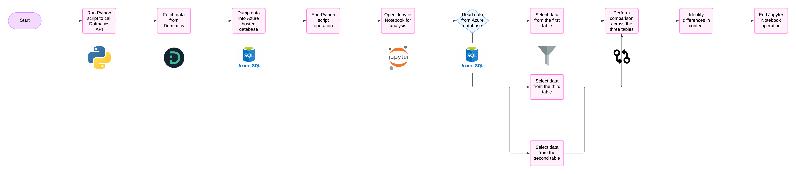

[Home](../../main.md) | [Prev: Day 40](notes_2024-12-03.md) | [Next: Day 42](./notes_2024-12-05.md)

## 📝 Day 41, Wednesday - `notes_2024-12-04.md`

- 1on1 with Genaro @ 10:00
    * discuss viz web app that can live on azure compute resource that renders plots from AbCellera data export
    * may need a temp database hosted on azure in order to stage the writeup data (US167) to compare globally across 3 DM instances
    * US169 writeup button display doesn't show expected quantity for reactants, however noticed the ELN_REAGENTS table has NULL value for `QUANTITY` column, may be present in `REACTANT_MASS`
- Brendan from RCH provided AWS sandbox account access thru Turbot
- Created wireframe on lucidcharts to illustrate eln writeup text comparison using azure hosted db
- US170 need to add logic to filter invalidated wells in export
- the view wizard csv export truncates the TMP_ELN_WRITEUP_EXP_IDS DS for some reason. Cannot get all 7800 rows which should be present, instead shows 4800?
    * used the following sql to listagg chunks of ids, however require a little more pre work:

```sql
WITH chunked_data AS (
    SELECT 
        CEIL(ROWNUM / 200) AS chunk_id,
        experiment_id
    FROM (SELECT experiment_id FROM tmp_eln_writeup_plhlder_extr)
),
aggregated_chunks AS (
    SELECT 
        chunk_id,
        LISTAGG(experiment_id, ',') WITHIN GROUP (ORDER BY experiment_id) AS chunked_ids
    FROM chunked_data
    GROUP BY chunk_id
)
SELECT chunked_ids FROM aggregated_chunks
;

-- this shows the count of each group which should match the 200 in the CEIL function
WITH t AS (
    SELECT 
        CEIL(ROWNUM / 200) AS chunk_id,
        experiment_id
    FROM tmp_eln_writeup_exp_ids
)
SELECT 
    chunk_id,
    COUNT(*) AS chunk_count
FROM t
GROUP BY chunk_id
ORDER BY chunk_id
;
```
- from this output (copied from table browser) pasted into a file called, `raw_numbers.txt` and ran the following python script to output as `output_numbers.txt`
```python
def process_numbers(input_file, output_file):
    with open(input_file, 'r') as infile, open(output_file, 'w') as outfile:
        for line in infile:
            numbers = line.strip().split(',')
            for number in numbers:
                outfile.write(f"{number}\n")

if __name__ == "__main__":
    input_file = 'raw_numbers.txt'
    output_file = 'output_numbers.txt'
    process_numbers(input_file, output_file)
```

- However, after further thinking this python script is not necessary and the output of the sql statement can be used directly in the api call
- The limit on the number of experiment IDs you can pass in a single API call can vary depending on the specific API and its implementation. However, a common limit for many REST APIs is around 100-200 parameters per request.
    * thus decided to create chunks of 200 

- in order to get jupyterlabs to work: Edit `/etc/docker/daemon.json` on host machine

```bash
{
    "dns": ["8.8.4.4", "8.8.8.8"]
}
```
- Restart the docker daemon for those changes to take effect: `sudo systemctl restart docker`
    * it couldn't resolve urls because the nameservers were 190.x.x.x format

- created postgresql RDS on aws sandbox account with superuser, Brendan provided superuser access
    * THQLq42TtVgXqXLaGK1K
    * prelude-dotmatics-eln-writeup.carfx9jfndbx.us-east-2.rds.amazonaws.com
    * created custom postgres inbound rule for security group and associated with the RDS postgresql database
    * set to publicly available in connections & security
```bash
docker run -it --rm -p 5432:5432 postgres psql --host=prelude-dotmatics-eln-writeup.carfx9jfndbx.us-east-2.rds.amazonaws.com --port=5432 --username=postgres --password
```

- US 159
- ran sql to check for per experiment properties from the admin dictionary panel that can be added to any number of protocols
- this is only for per protocol, however can't find table where it is stored globally
- this is not reversible; cannot edit or delete when added
```sql
select * from tm_prot_exp_fields_dict where property_name like 'Assay Total%'
;
```

- worked on US 167 python api script on jupyterlabs, `compare_eln_writeups.ipynb`
    * able to run all ~7800 exp ids on DEV and dumped data into postgresql rds instance (using free-tier)
    * able to access dm upgrade 6 website, but table browser wasn't working and neither did creating a datasource; until late 19:00
    * there are about 5k more exp ids on upgrade 6 compared to DEV
    * ran below sql to confirm exp ids exists on upgrade 6 instance:
```sql
select count(distinct(experiment_id)) from TMP_ELN_WRITEUP_PLHLDER_EXTR
where experiment_id IN (
--EXP IDS from exp_ids_eln_writeup_compr.txt
--each chunk should be exactly 200
)
;

-- for some reason had to re-write this sql probably due to new database clone from PROD on DEV
-- upgrade 6 also had the same error (invalid number) 
-- issue was the mask_id can be integer or string, so used TO_CHAR()
SELECT
    a.experiment_id,
    a.entry_date,
    a.match_position,
    a.mask_id,
    a.unique_id,
    b.mask_title,
    b.mask_text,
    c.write_up
  FROM tmp_eln_writeup_plhlder_extr a
  JOIN tmp_plhlder_extr_source_table b ON to_char(a.mask_id) = to_char(b.mask_id)
  JOIN eln_writeup c ON a.experiment_id = c.experiment_id
  WHERE EXISTS
      (SELECT 1
       FROM tm_protocols p
       JOIN tm_experiments e ON p.protocol_id = e.protocol_id
       WHERE e.experiment_id = a.experiment_id
         AND p.protocol_id IN (
                                 501,
                                 481))
    AND c.write_up IS NOT NULL
    AND instr(c.write_up, '{{') > 0
  ORDER BY
    a.experiment_id DESC,
    a.match_position ASC
```

- DS_ID on upgrade 6 instance for API source (`TMP_ELN_WRITEUP_API_SRC`) is: 1371

#### lucidchart wireframe


