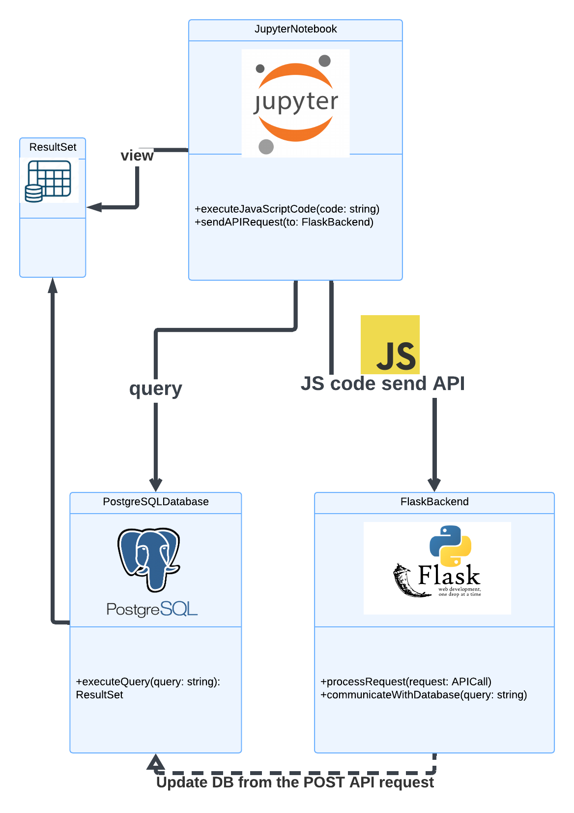

[Home](../../main.md) | [Prev: Day 65](notes_2025-01-15.md) | [Next: Day 67](./notes_2025-01-17.md)

## 📝 Day 66, Thursday - `notes_2025-01-16.md`

- US191:
    * updated git repo for dm scripts
    * testing using the user-facing jupyter notebook locally
    * testing on preludeX01 & lab-gen6 ivanti machine
    * created lucid chart diagram of tech stack used for checkboxes; and uploaded to devops board
    * added port 5000 to firewall rule on win11 PreludeX01 server



- US194 - DM python script to fetch writeup html:
    * contains placeholders and strange text sometimes, i.e. XXXXX & BLAH BLAH BLAH
    * exp id: 138443
    * the difference between these two are just the placeholders are '?'

#### PROD
```json
"[(22S,23R,24S,25R,26S,27R,37S,38S,39S)-39-acetoxy-24-[(2R,3S)-3-amino-2-hydroxy-3-(p-tolyl)propanoyl]oxy-22,27,38-trihydroxy-28,36,36,37-tetramethyl-30-oxo-49-oxatetracyclo[BLAH.BLAH.BLAH.BLAH.BLAH]heptadec-28-en-26-yl] benzoate (190.0 mg, 0.26 mmol){{9:row 1}}_XXXXX_  was added to DCM (200 mL){{3:row 1}}_XXXXX_  andditert-butyl carbonate (67.0 mg, 0.38 mmol){{9:row 2}}_XXXXX_  added to make  [(25S,26R,27S,28R,29S,30R,41S,42S,43S)-43-acetoxy-27-[(2R,3S)-3-(tert-butoxycarbonylamino)-2-hydroxy-3-(p-tolyl)propanoyl]oxy-25,30,42-trihydroxy-31,40,40,41-tetramethyl-33-oxo-55-oxatetracyclo[BLAH.BLAH.BLAH.BLAH.BLAH]heptadec-31-en-29-yl] benzoate (100 mg, 0.12167 mmol, ?% yield){{2:row 1}}_XXXXX_ "
```

#### DEV
```json
"[(22S,23R,24S,25R,26S,27R,37S,38S,39S)-39-acetoxy-24-[(2R,3S)-3-amino-2-hydroxy-3-(p-tolyl)propanoyl]oxy-22,27,38-trihydroxy-28,36,36,37-tetramethyl-30-oxo-49-oxatetracyclo[BLAH.BLAH.BLAH.BLAH.BLAH]heptadec-28-en-26-yl] benzoate ( mg, 0.26 mmol){{9:row 1}}_XXXXX_  was added to DCM (200 mL){{3:row 1}}_XXXXX_  andditert-butyl carbonate ( mg, 0.38 mmol){{9:row 2}}_XXXXX_  added to make  [(25S,26R,27S,28R,29S,30R,41S,42S,43S)-43-acetoxy-27-[(2R,3S)-3-(tert-butoxycarbonylamino)-2-hydroxy-3-(p-tolyl)propanoyl]oxy-25,30,42-trihydroxy-31,40,40,41-tetramethyl-33-oxo-55-oxatetracyclo[BLAH.BLAH.BLAH.BLAH.BLAH]heptadec-31-en-29-yl] benzoate (? mg, ? mmol, ?% yield){{2:row 1}}_XXXXX_ "
```

***REMOVED***
