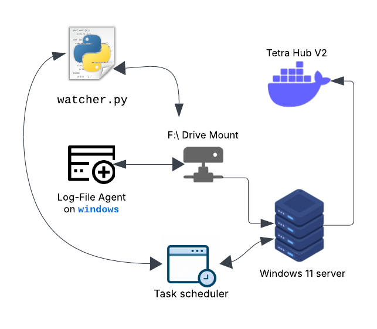

[Home](../../main.md) | [Prev: Day 122](notes_2025-04-09.md) | [Next: Day 124](./notes_2025-04-11.md)

## 📝 Day 123, Thursday - `notes_2025-04-10.md`

- US240 - DS refresh mystery
    * after removing the DS update trigger on `GENERIC_ASSAY_DATA_EXPORT` it seemed to prevent the 5 min DS refresh; no logs
    * then saved changes to refresh and clear run times
    * will have to wait for following day to see results
```bash
# from DS tab
10Apr 01:14:56.311 DEBUG chaining force on SQL Runner
10Apr 01:14:56.303 DEBUG complete in 896207.05ms

# from SQL Runner tab
10Apr 10:10:48.529 DEBUG clearing runTimes
10Apr 01:14:56.311 DEBUG force called
09Apr 13:22:07.355 DEBUG force called
09Apr 03:12:09.910 DEBUG force called
09Apr 03:06:56.992 DEBUG starting
09Apr 03:06:56.992 DEBUG run forced
09Apr 03:06:56.676 DEBUG force called
```

##### real-time debugging of compound swap
- chemistry team requested Genaro to swap PRT1012668 (PRT1012268) /PRT1012669
    * showed last modification and `reason` field to Genaro
    * seemed there wasn't any issue based on the audits
    * he will circle back since needs to confirm with chemistry team what really is the issue, or was it just a fluke

```sql
-- get reg_ids
select * from c$pinpoint.reg_data
where formatted_id in ('PRT1012268', 'PRT1012668', 'PRT1012669')
;

-- view audits
select * from c$pinpoint.reg_data_audit
where reg_id = 1012669
```

##### test python script - image de-duplicator
- wrote test script, `attune_rm_dups_img.py`
    * tested in `/tmp` dir and seems to work:
    * the logic is to only detect new folders with `.bmp` or `.png` files at the moment
    * then modularised it into separate files and allowed to use `argparse` to pass args
```bash
python attune_rm_dups_img.py
Watching folder: /tmp/raw-images for new folders...
Detected new folder: /tmp/raw-images/imgs001

Processing 1 folders...

10 image(s) found in /tmp/raw-images/imgs001
Unique:    imgs001/image_5.bmp
Unique:    imgs001/image_9.bmp
Unique:    imgs001/image_3.bmp
Unique:    imgs001/image_10.bmp
Unique:    imgs001/image_2.bmp
Unique:    imgs001/image_4.bmp
Unique:    imgs001/image_6.bmp
Unique:    imgs001/image_7.bmp
Unique:    imgs001/image_1.bmp
Unique:    imgs001/image_8.bmp

Done. Waiting for more folders...
```
---

## 🧠 1. **Perceptual Hashing (imagehash)**
When `method='hash'`.

### ✅ Core Idea:
Instead of hashing the exact pixel values (like a cryptographic hash), a **perceptual hash** captures the *visual essence* of an image — structure, tone, or shapes — so that **visually similar images produce similar hashes**.

### 🔢 How It Works (in `imagehash.phash`):
1. **Convert image to grayscale**.
2. **Resize** image to a small, fixed size (usually 32x32 or 8x8).
3. Apply the **Discrete Cosine Transform (DCT)** to extract frequency components.
   - DCT is like a simplified version of a Fourier transform — it tells you *how much change* (contrast, edges) is happening.
4. Take the top-left 8×8 block of low-frequency DCT coefficients (this captures the general shape/contrast).
5. Compute the **mean of the DCT values**, and **set each bit in the hash** depending on whether that coefficient is above or below the mean.
   - Result: a 64-bit hash (like `101011001...`).
6. To compare two hashes: compute the **Hamming Distance** (number of different bits).

### 📏 Hamming Distance:
```python
if (hash1 - hash2) < threshold:
    # Considered similar
```

This is fast and robust to:
- Compression artifacts
- Slight resizes or crops
- Small brightness shifts

---

## 🧪 2. **OpenCV + Mean Squared Error (MSE)**
This is more of a *direct pixel comparison* using OpenCV.

### ✅ Core Idea:
Compare images **numerically**, pixel by pixel. The assumption is that similar images should have low pixel-wise error.

### 🔢 MSE (Mean Squared Error):
Given two images A and B (both size W×H):

$$
\text{MSE} = \frac{1}{W \cdot H \cdot C} \sum_{i=1}^W \sum_{j=1}^H \sum_{k=1}^C (A_{ijk} - B_{ijk})^2
$$

Where:
- $(C)$ is the number of color channels (3 for RGB)
- $(A_{ijk}\) and \(B_{ijk})$ are pixel values

So it's the **average squared difference** between all corresponding pixels.

### 🧯 Threshold:
You define a `MSE_THRESHOLD` — above this, the image is too different.

### Pros:
- Very sensitive — good for exact duplicates or near-lossless modifications.

### Cons:
- Sensitive to even tiny changes (brightness, slight crop, compression).
- Slower than hashing.

---

## 🚦 Summary: When to Use What

| Method         | Fast | Robust to Small Changes | Good for Near-Identical | Works on Different Sizes |
|----------------|------|-------------------------|--------------------------|---------------------------|
| `imagehash`    | ✅   | ✅                      | ⚠️                       | ✅                        |
| `opencv + mse` | ❌   | ❌                      | ✅                       | ❌                        |

---


##### commands

```sh
# activate environ
conda activate tmp

# run the watcher
python3 -m image_dedup.watcher --method opencv

# generate random images
python3 -m image_dedup.generator --total-images 6 --similar-images 2
```

##### diagram
- setup of Tetrascience components for de-duplicating image files from Thermo Attune instrument
    * users run workflow on Attune instrument and dups a folder filled with 1000+ images
    * the `watcher.py` file will watch the F:\Imaging directory for these two project folders and parse all `.bmp` and `.png` files
    * it will run the `phash` or `mse` function to quickly determine if a pair of images are similar or not
    * if the image is unique it will migrate the image to a `unique` folder and the others will be migrated to an `archive` folder
    * the log file agent will watch the `unique` folder for new files and upload only those
    * on windows 11 server need to set up a Task Scheduler in order for it to always run even on restart


