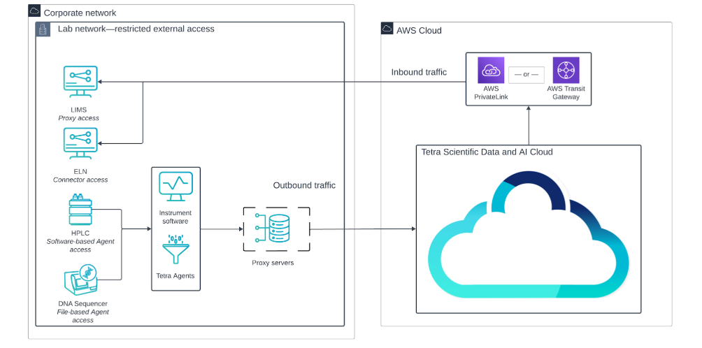

[Home](../../main.md) | [Prev: Day 132](notes_2025-04-23.md) | [Next: Day 134](./notes_2025-04-25.md)

## 📝 Day 133, Thursday - `notes_2025-04-24.md`

- 1on1 Jason RCH
    * possible extension or direct hire from RCH
    * need to provide Craig contract details to go over before moving forward with any changes post-contract
        * copy paste only relevant snippet

- US261 - SUMM_JAK2
    * added `TMP_SUMM_JAK2` to JAK2-Degrader project to allow users to validate data
    * removed `TMP_OUTPUT_JAK2_PRTN` from Registry 2.0 project on PROD since this was done to export to `.csv`

##### Research and investigation on FLA architecture for existing pipelines that currently use Egnyte:
- Host FLAs on independent cloud Windows servers (e.g. AWS EC2), with dedicated FLA deployments per Tetra deployment. This allows you to have control of which data goes into your different environments, and also lets you hibernate FLA hosts when they are not needed (see diagram below)
    * A centralized FLA strategy allows for easier administration, though it requires the FLA host server to have access to instrument data.
    * While it is technically feasible to install an FLA directly to your instrument PC, we do not recommend this.

##### Recommended Approaches for Cloud / On-Premises Network Connectivity
- The recommended networking architecture provides the following benefits:
    * Reduces on-premises infrastructure needs
    * Uses common industry networking solutions
    * Limits infrastructure and security teams to on-premises Tetra Agent installation only
    * Enables TetraScience-managed components without elevated permissions
- Recommended Architecture
    * The following diagram shows an example networking architecture for connecting on-premises (or VPC components) to the TDP:

- The diagram shows the following networking workflow:
    * For Outbound traffic (from the customer’s network to the TDP), forward proxy servers provide connectivity between Tetra Integrations and the TDP. Allow lists configured on each proxy provide connectivity to the required TDP and AWS endpoints.
    * For Inbound traffic (from the TDP to the customer’s network), either AWS PrivateLink or AWS Transit Gateway is used to securely connect and distribute incoming traffic. Allow lists on each proxy provide connectivity to the required TDP and AWS endpoints. If there’s a need for a single ingress point, customers should use AWS Transit Gateway.

##### File Log Agents Metadata
- example `.xlsx` file available at [link](https://docs.google.com/spreadsheets/d/1ftAjWRjTMp96fM2aF-IE5vpAcj9zkvhx/edit?usp=drive_link&ouid=102373390326328783035&rtpof=true&sd=true)

| File Path | FLA Mode | instrument_owner (required) | department (required) | instrument_serial_number (required) | pc_name | instrument_model | instrument_type | vendor |
|-----------|----------|-----------------------------|------------------------|--------------------------------------|---------|------------------|------------------|--------|

- seems as though whoever configured/set up your pipelines and attribute definition for all files didn't follow the Tetrascience [documentation](https://tetrascience.zendesk.com/hc/en-us/articles/29488778355853-File-based-data-onboarding-and-contextualization)
    * >As you install and configure your File Log Agents, you will need to assemble configuration details, including the network path of data to ingest and all associated static metadata (for examples, see [Recommended Labels](https://tetrascience.zendesk.com/hc/en-us/articles/29736256140301-Recommended-Labels) )  

- On PROD a sample file shows these labels which are sufficient for the pipeline; but should adhere to the table above in addition to these

---

## **AWS-Based NGS Data Analysis Proposal**  
- Notes extraction on bioinformatic NGS pipeline:
- Used image parser to get text

### 1. Executive Summary  
This proposal outlines a scalable, secure, and cost-effective AWS-based platform to support next-generation sequencing (NGS) data analysis for approximately 30 patient samples over a period of 6–10 months. The platform will leverage DRAGEN and GATK workflows via AWS Genomics CLI to conduct efficient variant calling and RNA-seq analysis. Data will be securely stored and processed in AWS, with storage lifecycle planning and IAM-based access controls. Estimated costs for compute and storage are projected to remain under $14,000.

---

### 2. Project Objectives  
- Analyze ~30 patient samples using DRAGEN and GATK workflows  
- Retain approximately 5 TB of intermediate and processed data in AWS S3  
- Complete downstream analyses including differential expression, CNV visualization, and fusion detection  
- Ensure reproducibility, scalability, and cost optimization

---

### 3. Technical Plan  

**Pipeline Tools & Workflow**  
- **Primary:** DRAGEN (f1.16xlarge, f1.4xlarge instances) and GATK  
- **Integration:** AWS Genomics CLI  
- **Downstream:** Custom and open-source pipelines for RNA-seq, mutational analysis, CNVs, and fusion events

**Data Characteristics**  
- Average input FASTQ size per sample: ~8 GB (4 GB R1, 4 GB R2)  
- Intermediate data (e.g., BAMs, VCFs) will be retained for reproducibility

**Storage Architecture**  
- **Initial:** Amazon S3 Standard (~5 TB)  
- **Long-Term:** Lifecycle policy to transition to S3 Glacier after project close

---

**Questions:**
**Project?**
- 3789

**Scope of the effort**
- Number samples analyzed per month  
  - 100 – Total ?

- **f1.16xlarge DRAGEN instance licensed from Illumina** costs from $13–$60/hr  
  - 2TB RAM, 192 core, ?? FPGA, NVME - 8*950GB 25Gbps (EC2PRICING.com)

**Project estimated cost**
- Contractor – $8k – 40 hours monthly max? 20 hours per month  
- AWS instance ≈ ~$1500 monthly

---

**Project Clarification Questions**

1. **Pipeline Tools & Workflow**  
   - DRAGEN & GATK workflows will be used  
     - Integration of AWS Genomics CLI

2. **Data Input/Output Size**  
   - Average FASTQ file 4G read1, 4G read2  
   - We want to retain intermediate files so we don’t need to reprocess.

3. **Storage Class**  
   - We will recommend S3 Standard for the immediate project and migrate to S3 Glacier next year.

4. **Security and Compliance**  
   - No HIPAA requirements?  
   - No encryption during rest

5. **Team and Access**  
   - Three access to Console  
   - Separate policy for developer on project and for data viewers.

6. **Budget Considerations**  
   - What is the range of the budget?

7. **Data Transfer**

---
