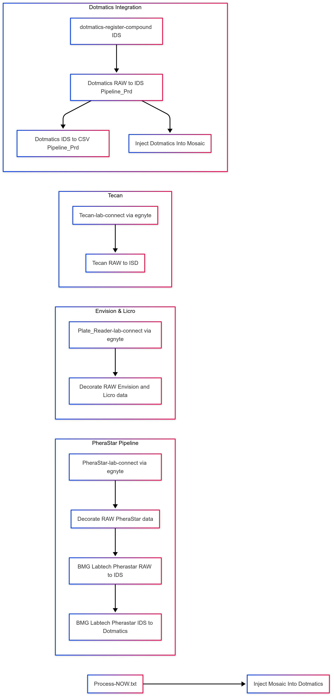

[Home](../../main.md) | [Prev: Day 133](notes_2025-04-24.md) | [Next: Day 135](./notes_2025-04-28.md)

## 📝 Day 134, Friday - `notes_2025-04-25.md`

- US265 - tetrascience investigation:
    * Why isn’t a Tetra Hub always recommended?
        * Tetra Hubs aren’t part of the recommended networking architecture for two reasons:
        * They require a security exception from the customer to allow AWS Systems Manager (SSM) Agent and Amazon Elastic Compute Cloud (Amazon EC2) roles.
        * They create another on-premises resource that the customer needs to manage.
    * Created shared excel sheet on FLA configuration network path file
        * Generated the US266 devops for this task; PreludeTx needs to fill out metadata
    * Decorate RAW PheraStar data -> Source Name=PheraStar-lab-connect (via egnyte)
    * BMG Labtech Pherastar RAW to IDS -> Source Name=Decorate RAW PheraStar data 
    * BMG Labtech Pherastar IDS to Dotmatics -> Source Name=BMG Labtech PheraStar RAW to ISD
    * Decorate RAW Envision and Licro data -> Source Name=Plate_Reader-lab-connect (via egnyte)
    * Tecan RAW to ISD -> Source Name=Tecan-lab-connect (via egnyte)
    * Inject Mosaic Into Dotmatics -> Source Name=Process-NOW.txt
    * Dotmatics IDS to CSV Pipeline_Prd -> Source Name=Dotmatics RAW to IDS Pipeline_Prd
    * Dotmatics RAW to IDS Pipeline_Prd -> Source Name=dotmatics-register-compound (IDS)
    * Inject Dotmatics Into Mosaic -> Source Name=Dotmatics RAW to IDS Pipeline_Prd

##### Mermaid code for diagram of above relationship
```
graph LR
    subgraph PheraStar Pipeline
        A["PheraStar-lab-connect via egnyte"] --> B["Decorate RAW PheraStar data"]
        B --> C["BMG Labtech Pherastar RAW to IDS"]
        C --> D["BMG Labtech Pherastar IDS to Dotmatics"]
    end

    subgraph Envision & Licro
        E["Plate_Reader-lab-connect via egnyte"] --> F["Decorate RAW Envision and Licro data"]
    end

    subgraph Tecan
        G["Tecan-lab-connect via egnyte"] --> H["Tecan RAW to ISD"]
    end

    subgraph Dotmatics Integration
        K["dotmatics-register-compound IDS"] --> L["Dotmatics RAW to IDS Pipeline_Prd"]
        L --> M["Dotmatics IDS to CSV Pipeline_Prd"]
        L --> N["Inject Dotmatics Into Mosaic"]
    end

    I["Process-NOW.txt"] --> J["Inject Mosaic Into Dotmatics"]
```



#### DSL Elastic Query Language testing

Run a Query DSL Query by Using the Label & Advanced Filters Menu
To run a direct Query DSL query by using the Label & Advanced Filters menu on the Search (Classic) page, do the following:

* Open the Search **(Classic page)**.
* Choose Label & Advanced Filters. A dialog appears that includes filter options as different tabs.
* Select the Raw EQL tab. The /searchEql endpoint request displays.
* Edit the query as needed for your use case. **(See Query DSL Best Practices)**.
* **(Optional)** To run the query without validating the query structure, select the No validation check box.
* Choose Run EQL. The query runs and displays the Response.
```json
## too generic 52k hits
{
  "query": {
    "query_string": {
      "query": "269864_01.csv"
    }
  }
}


## use of filePath
{
  "query": {
    "bool": {
      "must": [
        {
          "term": {
            "filePath": "/Private/lab-connect/Screening/PlateReader_Gen2/269909_01.csv"
          }
        }
      ],
      "must_not": [
        {
          "term": {
            "outdated": true
          }
        },
        {
          "term": {
            "deleted": true
          }
        }
      ]
    }
  }
}


## use of fileid

{
  "query": {
    "bool": {
      "must": [
        {
          "term": {
            "fileId": "ecafa666-a451-49c6-9626-cbc325139ba0"
          }
        }
      ],
      "must_not": [
        {
          "term": {
            "outdated": true
          }
        },
        {
          "term": {
            "deleted": true
          }
        }
      ]
    }
  }
}


## use of exp id

{
  "query": {
    "bool": {
      "must": [
        {
          "nested": {
            "path": "labels",
            "query": {
              "bool": {
                "must": [
                  {
                    "term": {
                      "labels.name": "experiment_id"
                    }
                  },
                  {
                    "term": {
                      "labels.value": "269909"
                    }
                  }
                ]
              }
            }
          }
        }
      ],
      "must_not": [
        {
          "term": {
            "outdated": true
          }
        },
        {
          "term": {
            "deleted": true
          }
        }
      ]
    }
  }
}
```

### BG267 - Dotmatics browser page inconsistency for ">" cases
* sql testing 

```sql
SELECT
    s.display_name AS formatted_batch_id,
    p.name         AS plate_name,
    wl.experiment_id,
    tm.experiment_name,
    tp.protocol,
    tp.cell_line,
    tp.assay_type,
    tp.target,
    tm.descr,
    CAST(wr.created_date AS DATE) AS created_date,
    tp.passage,
    w.sample_num,
    ar.RESULT_NUMERIC,
    ar.reported_result,
    wl.name        AS layer,
    wr.value       AS result,
    ar.param4      AS ic50
FROM
    ds3_userdata.su_well_results wr
    JOIN ds3_userdata.su_well_layers  wl ON wl.id = wr.layer_id and wl.experiment_id = 268942
    JOIN ds3_userdata.su_wells        w ON w.id = wr.well_id
      AND w.status = 0
    JOIN ds3_userdata.su_well_samples ws ON ws.well_id = w.id
    JOIN ds3_userdata.su_samples      s ON s.id = ws.sample_id AND s.display_name = 'PRT1012845-001'
    JOIN ds3_userdata.su_plates       p ON p.id = w.plate_id
    JOIN ds3_userdata.su_plate_results pr ON pr.plate_id = p.id
      AND pr.layer_id = wl.id
    JOIN ds3_userdata.su_groupings g ON g.experiment_id = wl.experiment_id      
AND g.sample_id = s.id
      AND g.plate_set = p.plate_set
    JOIN ds3_userdata.su_analysis_results ar ON ar.group_id = g.id
      AND ar.status <> 2
    JOIN (
      SELECT
         experiment_id,
         experiment_name,
         protocol_id,
         isid,
         descr
      FROM ds3_userdata.tm_experiments 
    ) tm ON tm.experiment_id = wl.experiment_id
    LEFT JOIN (
      SELECT *
        FROM (
            SELECT
                tm.experiment_id,
                p.protocol,
                tm.property_name,
                tm.property_value
            FROM ds3_userdata.tm_prot_exp_fields_values tm
            JOIN ds3_userdata.tm_protocols p
              ON p.protocol_id = tm.protocol_id
            WHERE tm.property_name IN ('Cell Line', 'Target', 'Passage', 'Assay Type')
        ) src
      PIVOT (
          MAX(property_value)
          FOR property_name IN ('Cell Line' AS Cell_Line,
                                'Target' AS Target,
                                'Passage' AS Passage,
                                'Assay Type' AS Assay_Type)
      )
    ) tp ON tp.experiment_id = g.experiment_id


-- check missing resp@hc for prt#
    with t as(            SELECT
                    *
                FROM
                    (
                        (
                            SELECT
                                formatted_id,
                                power(
                                    10, AVG(log(
                                        10,
                                        CASE
                                        WHEN ic50 > 0 THEN
                                            ic50
                                        ELSE
                                        NULL
                                        END
                                    ))
                                )                   AS p,
                                NULL                AS r,
                                power(
                                    10, AVG(log(
                                        10,
                                        CASE
                                        WHEN span > 0 THEN
                                            span
                                        ELSE
                                        NULL
                                        END
                                    ))
                                )                   AS pspan,
                                power(
                                    10, AVG(log(
                                        10,
                                        CASE
                                        WHEN min > 0 THEN
                                            min
                                        ELSE
                                        NULL
                                        END
                                    ))
                                )                   AS min,

                                power(10, avg(log(
                                          10,
                                          CASE
                                          WHEN response_at_hc > 0 THEN
                                            response_at_hc
                                          ELSE
                                          NULL
                                          END
                                    ))
                                )                   AS presp_hc,
                                NULL                AS minr,
                                STDDEV(ic50)        AS sd,
                                STDDEV(span)        AS sdspan,
                                assay_type,
                                cell_line,
                                compound_status,
                                COUNT(formatted_id) AS c,
                                time_hr
                            FROM
                                ds3_userdata.kat6a_registry_summary
                            WHERE
                                compound_status IS NULL
                            GROUP BY
                                formatted_id,
                                assay_type,
                                cell_line,
                                time_hr,
                                compound_status
                        )
                        UNION ALL
                        (
                            SELECT
                                formatted_id,
                                NULL                AS p,
                                MAX(ic50)           AS r,
                                power(
                                    10, AVG(log(
                                        10,
                                        CASE
                                        WHEN span > 0 THEN
                                            span
                                        ELSE
                                        NULL
                                        END
                                    ))
                                )                   AS pspan,
                                NULL                AS min,
                                power(10, avg(log(
                                          10,
                                          CASE
                                          WHEN response_at_hc > 0 THEN
                                            response_at_hc
                                          ELSE
                                          NULL
                                          END
                                    ))
                                )                   AS presp_hc,
                                power(
                                    10, AVG(log(
                                        10,
                                        CASE
                                        WHEN min > 0 THEN
                                            min
                                        ELSE
                                        NULL
                                        END
                                    ))
                                )                   AS minr,
                                STDDEV(ic50)        AS sd,
                                STDDEV(span)        AS sdspan,
                                assay_type,
                                cell_line,
                                compound_status,
                                COUNT(formatted_id) AS c,
                                time_hr
                            FROM
                                ds3_userdata.kat6a_registry_summary
                            WHERE
                                compound_status IS NOT NULL
                            GROUP BY
                                formatted_id,
                                assay_type,
                                cell_line,
                                time_hr,
                                compound_status
                        )
                    )
)
select * from t
where formatted_id = 'PRT1012845'


--
SELECT
    s.display_name AS formatted_batch_id,
    p.name         AS plate_name,
    wl.experiment_id,
    tm.experiment_name,
    tp.protocol,
    tp.cell_line,
    tp.assay_type,
    tp.target,
    tm.descr,
    CAST(wr.created_date AS DATE) AS created_date,
    tp.passage,
    w.sample_num,
    ar.RESULT_NUMERIC,
    ar.reported_result,
    wl.name        AS layer,
    wr.value       AS result,
    ar.param4      AS ic50
FROM
    ds3_userdata.su_well_results wr
    JOIN ds3_userdata.su_well_layers  wl ON wl.id = wr.layer_id and wl.experiment_id = 268942
    JOIN ds3_userdata.su_wells        w ON w.id = wr.well_id
      AND w.status = 0
    JOIN ds3_userdata.su_well_samples ws ON ws.well_id = w.id
    JOIN ds3_userdata.su_samples      s ON s.id = ws.sample_id AND s.display_name = 'PRT1012845-001'
    JOIN ds3_userdata.su_plates       p ON p.id = w.plate_id
    JOIN ds3_userdata.su_plate_results pr ON pr.plate_id = p.id
      AND pr.layer_id = wl.id
    JOIN ds3_userdata.su_groupings g ON g.experiment_id = wl.experiment_id      
AND g.sample_id = s.id
      AND g.plate_set = p.plate_set
    JOIN ds3_userdata.su_analysis_results ar ON ar.group_id = g.id
      AND ar.status <> 2
    JOIN (
      SELECT
         experiment_id,
         experiment_name,
         protocol_id,
         isid,
         descr
      FROM ds3_userdata.tm_experiments 
    ) tm ON tm.experiment_id = wl.experiment_id
    LEFT JOIN (
      SELECT *
        FROM (
            SELECT
                tm.experiment_id,
                p.protocol,
                tm.property_name,
                tm.property_value
            FROM ds3_userdata.tm_prot_exp_fields_values tm
            JOIN ds3_userdata.tm_protocols p
              ON p.protocol_id = tm.protocol_id
            WHERE tm.property_name IN ('Cell Line', 'Target', 'Passage', 'Assay Type')
        ) src
      PIVOT (
          MAX(property_value)
          FOR property_name IN ('Cell Line' AS Cell_Line,
                                'Target' AS Target,
                                'Passage' AS Passage,
                                'Assay Type' AS Assay_Type)
      )
    ) tp ON tp.experiment_id = g.experiment_id


-- 
select * from IC50_NEW_RESULTS_SUMMARY
where ID = 'PRT1012845-001'
and experiment_id = 268942


-- 
SELECT
    t4.experiment_id AS experiment_id,
    t3.display_name  AS id,
    t6.name          AS analysis_name,
    TO_DATE(substr(
        t1.modified_date, 1, 10
    ))               AS modified_date,
    t10.plate_number,

    t1.reported_result,

    CASE
    WHEN t5.label = 'Inactive'    THEN
    t1.x_max
    WHEN t5.label = 'Very Potent' THEN
    t1.x_min
    ELSE
    t1.param4
    END              AS ic50,
    CASE
    WHEN t5.label = 'Inactive'    THEN
    '>'
    WHEN t5.label = 'Very Potent' THEN
    '<'
    END              AS compound_status,
    CASE
    WHEN t1.reported_result = 'Infinity' THEN 'Infinity'
    WHEN t1.reported_result = '-Infinity' THEN '-Infinity'
    WHEN SUBSTR(t1.reported_result, 1, 1) IN ('>', '<') THEN
        SUBSTR(t1.reported_result, 1, 1) ||
        TO_CHAR(
            ROUND(
                TO_NUMBER(SUBSTR(t1.reported_result, 2)) * 1000,
                3 - FLOOR(
                    CASE
                        WHEN ABS(TO_NUMBER(SUBSTR(t1.reported_result, 2)) * 1000) > 0
                        THEN LOG(10, ABS(TO_NUMBER(SUBSTR(t1.reported_result, 2)) * 1000))
                        ELSE 0
                    END
                )
            ), 'FM9999999990.099'
        )
    WHEN REGEXP_LIKE(t1.reported_result, '^\d+(\.\d+)?$') THEN
        TO_CHAR(
            ROUND(
                TO_NUMBER(t1.reported_result) * 1000,
                3 - FLOOR(
                    CASE
                        WHEN ABS(TO_NUMBER(t1.reported_result) * 1000) > 0
                        THEN LOG(10, ABS(TO_NUMBER(t1.reported_result) * 1000))
                        ELSE 0
                    END
                )
            ), 'FM9999999990.099'
        )
    ELSE
        TO_CHAR(TO_NUMBER(SUBSTR(t1.reported_result, 1, 10) * 1000), 'FM9999999990.099')
END AS ic50_rr_nm,

    CASE
        WHEN t1.reported_result = 'Infinity' THEN 'Infinity'
        WHEN t1.reported_result = '-Infinity' THEN '-Infinity'
        WHEN SUBSTR(t1.reported_result, 1, 1) IN ('>', '<') THEN
            SUBSTR(t1.reported_result, 1, 1) ||
            TO_CHAR(
                ROUND(
                    TO_NUMBER(SUBSTR(t1.reported_result, 2)),
                    3 - FLOOR(
                        CASE
                            WHEN ABS(TO_NUMBER(SUBSTR(t1.reported_result, 2))) > 0
                            THEN LOG(10, ABS(TO_NUMBER(SUBSTR(t1.reported_result, 2))))
                            ELSE 0
                        END
                    )
                ), 'FM9999999990.099'
            )
        WHEN REGEXP_LIKE(t1.reported_result, '^\d+(\.\d+)?$') THEN
            TO_CHAR(
                ROUND(
                    TO_NUMBER(t1.reported_result),
                    3 - FLOOR(
                        CASE
                            WHEN ABS(TO_NUMBER(t1.reported_result)) > 0
                            THEN LOG(10, ABS(TO_NUMBER(t1.reported_result)))
                            ELSE 0
                        END
                    )
                ), 'FM9999999990.099'
            )
        ELSE 
            TO_CHAR(SUBSTR(t1.reported_result, 1, 10), 'FM9999999990.099')
        END AS ic50_rr,

        t4.protocol_id,
        t8.result        AS ic90,
        t9.name          AS name
    FROM
        ds3_userdata.su_analysis_results     t1
        LEFT JOIN ds3_userdata.su_groupings            t2 ON t1.group_id = t2.id
        LEFT JOIN ds3_userdata.su_samples              t3 ON t2.sample_id = t3.id
        LEFT JOIN ds3_userdata.tm_experiments          t4 ON t2.experiment_id = t4.experiment_id
        LEFT JOIN ds3_userdata.su_plates               t10 ON t10.experiment_id = t2.experiment_id
                                                AND t2.plate_set = t10.plate_set
        LEFT JOIN (
            SELECT
                b.experiment_id,
                b.plate_number,
                a.plate_id,
                c.well_analysis_id,
                round(
                    z_prime, 4
                ) AS z_prime,
                low_avg,
                high_avg
            FROM
                ds3_userdata.su_plate_results a
                LEFT JOIN ds3_userdata.su_plates        b ON a.plate_id = b.id
                LEFT JOIN ds3_userdata.su_well_layers   c ON b.experiment_id = c.experiment_id
                                                           AND a.layer_id = c.id
            WHERE
                c.well_analysis_id = 1
            ORDER BY
                b.experiment_id,
                b.plate_number
        )                                    t11 ON t10.id = t11.plate_id
        LEFT JOIN ds3_userdata.su_classification_rules t5 ON t1.rule_id = t5.id
        LEFT JOIN ds3_userdata.su_analysis_layers      t6 ON t1.layer_id = t6.id
        LEFT JOIN ds3_userdata.su_charts               t7 ON t7.result_id = t1.id
        LEFT JOIN ds3_userdata.su_derived_results      t8 ON t8.result_id = t1.id
        LEFT JOIN ds3_userdata.su_derived_analyses     t9 ON t9.id = t8.derived_analysis_id
    WHERE
        t1.status = 1
        AND t4.completed_date IS NOT NULL
        AND t4.protocol_id IN ( 542, 543, 544, 561, 562, 441 )
AND t3.display_name = 'PRT1012845-001'
AND t9.name in ('% Max Response', '% Response @HC')
ORDER BY
    t6.name,
    t3.display_name,
    t9.name

--


SELECT *
FROM
ds3_userdata.kat6a_registry_summary
where experiment_id =  268942
AND formatted_batch_id = 'PRT1012845-001'


-- 


SELECT
    TO_NUMBER(a.experiment_id)  AS experiment_id,
    a.created_date,
    b.ic50,
    substr(
        d.formatted_batch_id, 1, 10
    )                           AS formatted_id,
    e.response_at_hc,
    b.r2,
    CASE
    WHEN b.r2 < 0.3 THEN
    '>'
    ELSE
    ''
    END                         compound_status
FROM
    studies_summary a
    INNER JOIN ic50_results_summary   b ON a.experiment_id = b.experiment_id
    INNER JOIN ic50_exp_info          c ON b.experiment_id = c.experiment_id
    INNER JOIN c$pinpoint.reg_batches d ON b.id = d.formatted_batch_id
    INNER JOIN (
        SELECT 
            id,
            experiment_id, 
            response_at_hc,
            absolute_ic50
        FROM 
            ic50_new_results_summary
    ) e ON a.experiment_id = e.experiment_id AND d.formatted_batch_id = e.id
WHERE
    project_name_ro IN ( 'KAT6A', 'KAT6A - Deg' )
    AND c.protocol_id IN ( 341, 361, 402, 421, 544 )
    AND d.formatted_batch_id = 'PRT1012845-001'

--


SELECT
    t1.reported_result,
  CASE
    WHEN SUBSTR(t1.reported_result, 1, 1) IN ('>', '<') THEN
      SUBSTR(t1.reported_result, 1, 1) || 
      TO_CHAR(
        ROUND(
          TO_NUMBER(SUBSTR(t1.reported_result, 2, LENGTH(t1.reported_result) - 1)) * 1000, 
          3 - FLOOR(LOG(10, ABS(TO_NUMBER(SUBSTR(t1.reported_result, 2, LENGTH(t1.reported_result) - 1)) * 1000)))
        ), 'FM9999999990.099'
      )
    ELSE
      TO_CHAR(
        ROUND(
          t1.reported_result * 1000, 
          3 - FLOOR(LOG(10, ABS(t1.reported_result * 1000)))
        ), 'FM9999999990.099'
      )
  END AS REL_IC50_NM


FROM DS3_USERDATA.SU_ANALYSIS_RESULTS T1
JOIN DS3_USERDATA.SU_ANALYSIS_LAYERS T6 ON T1.LAYER_ID = T6.ID
JOIN DS3_USERDATA.SU_CLASSIFICATION_RULES T5 ON T1.RULE_ID = T5.ID
JOIN DS3_USERDATA.SU_GROUPINGS T2 ON T1.GROUP_ID = T2.ID
JOIN DS3_USERDATA.SU_SAMPLES T3 ON T2.SAMPLE_ID = T3.ID
JOIN DS3_USERDATA.SU_PLATES P ON P.PLATE_SET = T2.PLATE_SET 
                              AND P.EXPERIMENT_ID = T2.EXPERIMENT_ID
JOIN DS3_USERDATA.IC50_NEW_RESULTS_SUMMARY T8 ON T3.DISPLAY_NAME = T8.ID 
                                              AND T2.EXPERIMENT_ID = T8.EXPERIMENT_ID 
                                              AND P.PLATE_NUMBER = T8.PLATE_NUMBER

WHERE T2.EXPERIMENT_ID = 268942
  AND T3.DISPLAY_NAME = 'PRT1012845-001'
```
