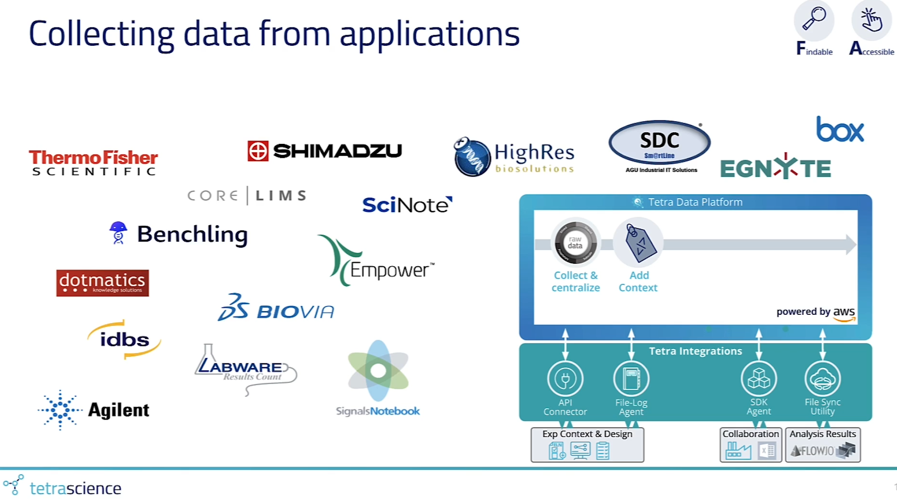
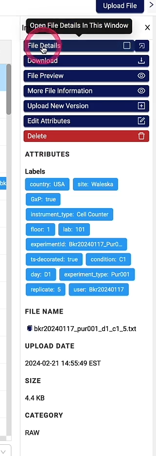

[Home](../../main.md) | [Prev: Day 136](notes_2025-04-29.md) | [Next: Day 138](../05/notes_2025-05-01.md)

## 📝 Day 137, Wednesday - `notes_2025-04-30.md`

#### US265 - research TS:
- *watched video*: `Collecting Data: Versioning and Lineage`
[https://www.tetrascience.com/videos/collecting-data-versioning-and-lineage](https://www.tetrascience.com/videos/collecting-data-versioning-and-lineage)
- Collecting data from various apps require context labels

- As mentioned prior in the first comment; the current pipelines only have bare minimum labels, according to the [Recommended Labels](https://tetrascience.zendesk.com/hc/en-us/articles/29736256140301-Recommended-Labels), there needs to be more metadata labels for each file as shown in the video (screenshot below).

#### Horizontally Scale Agents: FLA, Empower, Chromeleon [https://tetrascience.zendesk.com/hc/en-us/articles/31823341553165-Horizontally-Scale-Agents-FLA-Empower-Chromeleon](https://tetrascience.zendesk.com/hc/en-us/articles/31823341553165-Horizontally-Scale-Agents-FLA-Empower-Chromeleon)
- Data duplication:
    * >The users with access to change the source data or data access configuration must understand the implications and avoid this when possible. We recommend developing an internal approval process for any required data source and access changes to avoid accidental duplicate data. The “How to Partition …” instructions for each agent in this guide include steps to move data between agents safely, and your Customer Success Representative and TetraScience Support can provide technical assistance.

- The FLA operates on local directories and network file shares, so the logical partition is based on different FLA instances monitoring a unique set of file paths. When running multiple FLA instances to upload files from the same source location, best practices are to:
    1.  Set one "Destination Id" for all FLA instances which will monitor that network share
        
    2.  Define a unique set of non-overlapping Path Configurations in each FLA instance
        
    3.  If using the Archive feature, ensure that the archive destination is not monitored by any other agent instance; for example, target an entirely different archive-only network location

### How To Partition Existing Paths to a New Instance

To reduce latency when a single agent instance has already been running and ingesting data, the following general steps will allow you to partition the data across two or more instances. Example agents “FLA-1” (already running”) and “FLA-2” (new for scaling) are used.
1.  Install and configure a second FLA instance (FLA-2), do not start the agent or configure any paths
    
2.  Set the Destination Id for FLA-2 to be the “Agent Id” UUID of FLA-1
    
3.  Identify the folder paths and glob patterns to partition the files that FLA-2 will monitor
    
4.  Stop monitoring those paths in FLA-1, by either:
    1.  Using [Cloud Configuration while the agent is running](https://developers.tetrascience.com/docs/configuring-the-file-log-agent-in-the-cloud), remove the path(s) on FLA-1 and save the configuration
        
    2.  If not using Cloud Configuration, log into the FLA-1 host, manually stop the agent, delete the path(s) in the local management console, and start FLA-1 again
        
5.  Add the target path configurations to FLA-2 with the “Start Date” set to the current day (or when the paths were removed from FLA-1, if earlier, see the note below) by either:
    1.  Starting the agent with “Receive Commands” enabled and “Enable Queue” in the TDP agent settings , and using Cloud Configuration after a short time when the platform shows FLA-2 is online
        
    2.  Manually adding the path configurations in the FLA local management console, and starting the agent

#### Additional notes
- Reason I am able to make the statement that the backend uses Elasticsearch/Opensearch is from this code snippet from the docs: [Python-exec: Decorating raw and IDS files with context from IDS](https://tetrascience.zendesk.com/hc/en-us/articles/32839116952461-Python-exec-Decorating-raw-and-IDS-files-with-context-from-IDS)
    * it shows the prominent and obvious query syntax from EQL elastic query language
    * also when you view file properties within the tetrascience UI platform, and click the file journey tab, you can see that the file gets indexed

#### Elasticsearch/OpenSearch
- Is a distributed, scalable **search & analytics engine** for **near real-time** full-text search, structured data, and log analysis.

### **Core Features:**

*   **Full-text search** (Google-like queries)
    
*   **JSON document storage** (NoSQL database)
    
*   **Distributed & scalable** (handles petabytes)
    
*   **Real-time indexing & search** (~1 sec latency)
    
*   **REST API & Query DSL** (easy integration)
    
*   **Aggregations** (stats, trends, analytics)
    
*   **Used for:** Logging (ELK/OpenSearch stacks), product search, monitoring, security analytics.
    

### **Elasticsearch vs. OpenSearch**

*   **OpenSearch** is a fork of Elasticsearch (AWS-led, open-source, Apache 2.0 license).
    
*   **Elasticsearch** (Elastic NV) has some proprietary features in newer versions.
