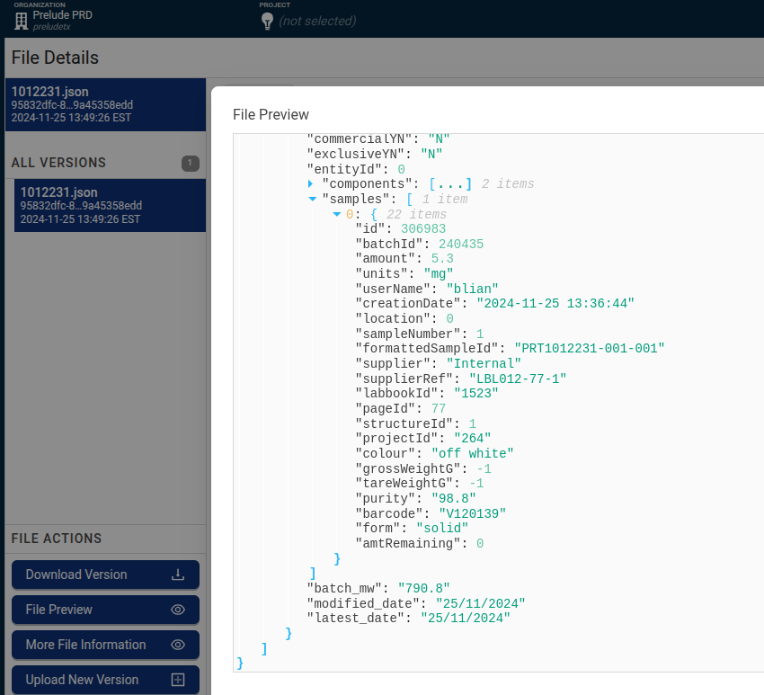
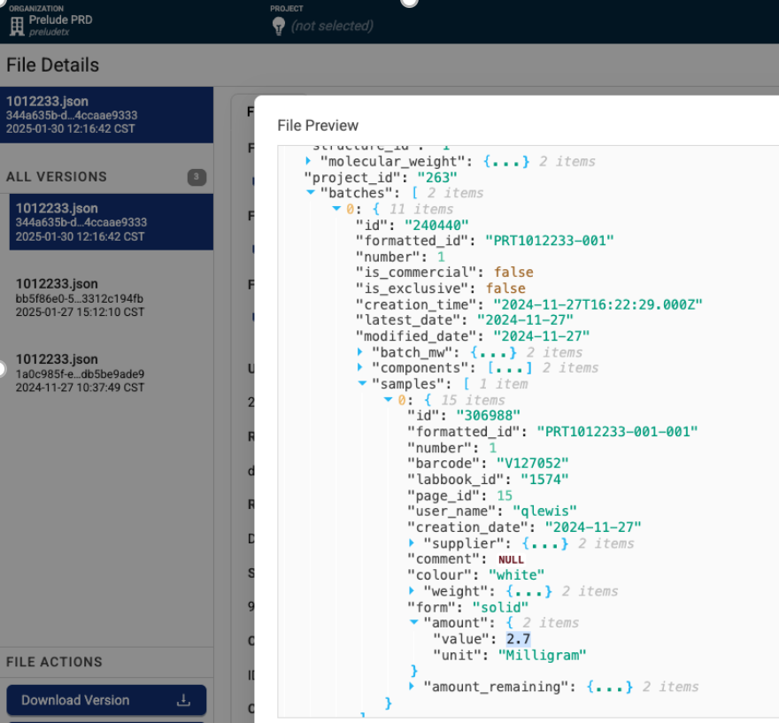

[Home](../../main.md) | [Prev: Day 142](notes_2025-05-07.md) | [Next: Day 144](./notes_2025-05-09.md)

## 📝 Day 143, Thursday - `notes_2025-05-08.md`

### US274 - UAT testing Envision & Tecan BioChem Experiments with TetraFLA
- 1on1 with PreludeTx
    * noted that the `date modified` attribute is very important, if copying a file from older time for UAT testing, it must be modified internally in some way so that the `date modified` can change. the FLA was configured on UAT environment starting 7 May 2025; so `date modified` needs to be on this date or later for the FLA to detect a new file
    * Genaro to test new batch of `*.csv` files, `267989 gss copy.csv` on `F:\` drive. Trigger was successful and file details can be seen on data lake


### Mosaic Dotmatics Tetrascience pipeline issue:

Below is a forum diagloue between Tetrascience tech support and PreludeTx showing an issue with a tetrascience pipeline that basically calls api endpoints to a Mosaic api to update inventory data for a compound registry system that lives on Dotmatics. Tetrascience is the glue that connects Dotmatics and Mosaic so that data is coherent and synchronized. 

>Dotmatics - Mosaic Pipeline is resetting the compound inventory amount again 
>Our pipeline appears to be resetting the inventory on compounds when batch number `002` or higher samples are registered again.  We have a number of impacted records and are trying to assess the extent of this rest this time around.  Here is an example so we can review the logs and identify a solution.  
>Quincy submitted two vials of `PRT1012233-002` last Monday but had only registered the smaller `2.2 mg`. Quincy register the second larger sample of batch 2 in Dotmatics 2 days later.  Registration of the 2nd batch `-002` vial reset the inventory of `PRT1012233-001` to `2.7mg` and the tube had already been solubilized.   

```text
PRT1012233-002      V125656      2.2 mg 
PRT1012233-002       V125657      23.1 mg 
```
  

>Here are additional compounds and instances:  

>Investigating older compounds: 
```
PRT1004389-001 not impacted (was in the past) 
PRT1004389-007 
PRT1003789-041(last one) was impacted last time not this time 

JAK compound investigation: 
PRT1012179-001 reset 11/20/2024, 12/10/2024, 1/7/2025, 1/13/2025, 1/27/2025 
PRT1010099-002 reset 11/07/2024, 11/26/2024, 12/30/2024 
 
KAT compounds 
PRT1007160-001 not impacted 
PRT1011982-001 reset 11/11/2024 
PRT1012242-001 reset 12/2/2024 
PRT1012174-001 reset 11/18/2024, 11/21/2024 
```
  
>I am looking into the two most recent versions of this IDS file which you mention in your example for `PRT1012233-001`. 
>Both the `1/27` and `1/30` versions of this file contain the `2.7 mg` value in `$.batches.[0].samples.[0].amount.value` relating to the first vial and barcode `V127052`. 

### 1012231.json - different payload format
- date: `2024-11-25 13:49:26 EST`


### 1012233.json - original payload format


>The associated workflows both show setting this value to `2.7` in Mosaic based on the lookup. 
  
 

```bash
POST https://prelude.mosaic-cloud.com/api/inventory/Substances/SynchroniseRegistrationSubstances
Response Code: 200
```

```text
Substance definition synchronised! 
Substance with substance_id: 49751 matched with formatted_id: PRT1012233-001 
Sample idx: 0, dotmatics_barcode: V127052 
Substance amount (from IDS): 2.7 
```

```bash
GET https://prelude.mosaic-cloud.com/api/inventory/LabwareItems?barcodes=V127052&expand=sampleHolders
Response Code: 200
```

```text
Labware found! labware_item_id: 81247 
Using Mosaic API endpoint: https://prelude.mosaic-cloud.com/api/inventory/SampleHolders 
```

```bash
GET https://prelude.mosaic-cloud.com/api/inventory/SampleHolders?labwareItemIds=81247
Response Code: 200
```
 
```text
Sample holder info: holder_substance_id: 49751,  
holder_current_amount: 261.0,  
position_x: 1, 
position_y: 1 
                 
Sample holder for substance_id: 49751 has already this substance. ''Setting it empty! 
```

```bash
DELETE https://prelude.mosaic-cloud.com/api/inventory/SampleHolders/81247@(1,1)/DeleteSample
Response Code: 204
```

```text
Response Mosaic API endpoint: https://prelude.mosaic-cloud.com/api/inventory/SampleHolders/81247@(1,1)/DeleteSample, response code: 204 
Updating sample holder for substance_id: 49751 with amount: 2.7 
```

  
>Is this the part of the flow that is resetting the compound inventory? If so how should this work differently in this case? 
>That appears to be where it is being reset. We just identified what is triggering the events.  Here's an example from the Dotmatics to IDS pipeline:  
>Compound `1010099` was created 12/1/2023 and 6 additional batches were created.  Each batch triggers a reset of the container contents to the original batch amount despite material being removed from the tubes. Here's a snapshot of the audit trail


### Overview
- The underlying issue is that the TetraScience pipeline does not perform additive or delta-based inventory updates. Instead, when a new sample (often from an existing batch) is registered in Dotmatics:
    * The pipeline overwrites the entire inventory value in Mosaic for the existing substance.
    * It doesn’t preserve current inventory state (e.g., after usage or solubilization).
    * The pipeline clears the container content via `/DeleteSample` and re-applies the full amount from the latest `IDS` payload.
    * This is a destructive update that resets history, leading to data corruption in inventory tracking.
    * Probably need to modify the TetraScience pipeline to:
        * Fetch the current Mosaic inventory state
        * Compute the delta or addition (rather than replacing)
        * Only apply updates if the barcode or sample is new, or if no prior amount exists
        * Add safeguards:
            * Prevent overwrites if holder_current_amount is non-zero and older than the sample being registered
            * Log warnings before destructive updates
