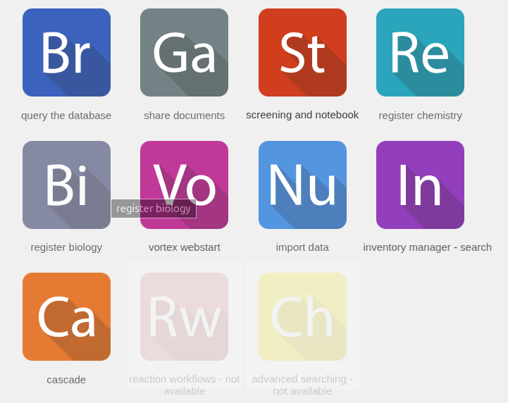
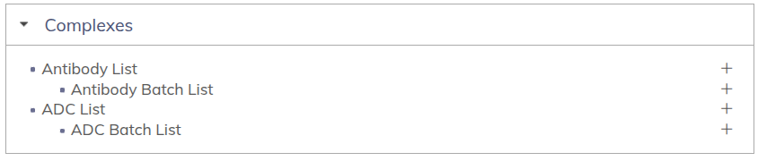
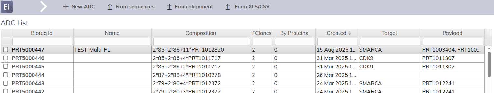
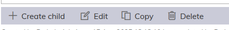
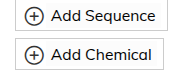

# How-To Guide: Add Chemical Entity in Dotmatics Bioregister  

## Overview  
This guide walks you through the process of **adding an additional chemical entity** in the Bioregister module of Dotmatics. Each step includes a screenshot and instructions.  

---

### Step 1: [Bioregister]  
  
**Instruction:**  
Click on `register biology` module from the home page.

### Step 2: [ADC List]  
  
**Instruction:**  
Click on `ADC List`

---

### Step 3: [Click on PRT Number (ADC)]  
  
**Instruction:**  
Click on the ADC that you want to add the chemical entity to from the list

---

### Step 4: [Edit ADC]  
  
**Instruction:**  
Click the `Edit` button at the bottom of the page
- Also to note. If you desire to delete the ADC; you can do so here as well by clicking `Delete`

---

### Step 5: [Add Entity]  
  
**Instruction:**  
Scroll towards the bottom and click `Add Chemical`. This will create a new drop-down menu where you can select the chemical entity by PRT number.

### Step 6: [Save]  
  
**Instruction:**  
Once changes are confirmed visually, scroll to the bottom and click `Update` to save the changes to the ADC
